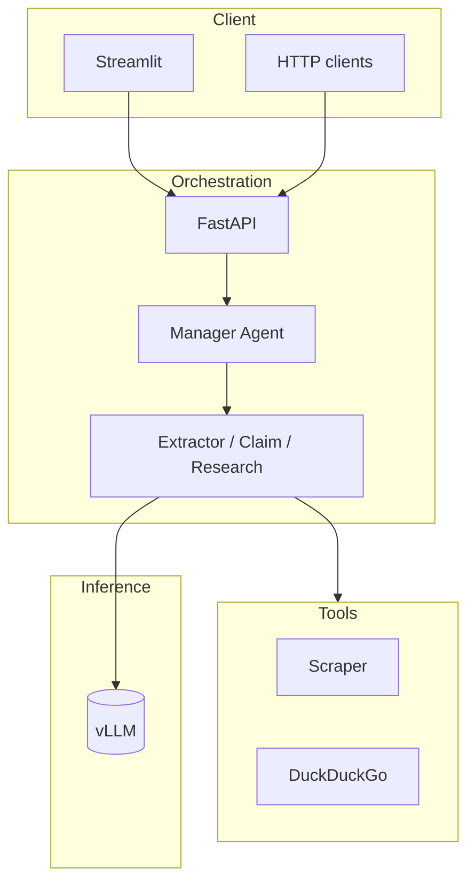

# Automated Fact-Checking Agentic Pipeline

[](https://github.com/itsvaidahipatel/automated-fact-checking-pipeline/actions/workflows/ci.yml)

**Vaidahi Patel** · [GitHub](https://github.com/itsvaidahipatel)

A multi-agent system that verifies claims and social-media URLs against web evidence. It returns a structured verdict, confidence score, and source citations. Orchestration runs on a standard host; inference is served through vLLM (OpenAI-compatible API).

| | |
|---|---|
| **Architecture** | [docs/ARCHITECTURE.md](docs/ARCHITECTURE.md) |
| **Evaluation** | [docs/EVAL.md](docs/EVAL.md) |
| **Summary** | [docs/PROJECT_SUMMARY.md](docs/PROJECT_SUMMARY.md) |

---

## Highlights

- Hierarchical agents (extract → claim → research) via [smolagents](https://huggingface.co/docs/smolagents)
- Decoupled GPU inference (vLLM) from FastAPI orchestration
- Citation grounding and request safety checks on the API layer
- 52-claim labeled evaluation harness with optional Ragas metrics
- Docker Compose, GitHub Actions CI, and pytest

---

## Results

| Metric | Value |
|--------|-------|
| Eval dataset | 52 labeled claims ([fixture](evals/fixtures/labeled_claims.json)) |
| End-to-end accuracy | See [latest report](evals/results/pipeline_eval_latest.json) |
| Methodology | [docs/EVAL.md](docs/EVAL.md) |

```bash
export PYTHONPATH=.
set -a && source .env && set +a
python evals/run_pipeline_eval.py --ragas-subset 15 \
  --output evals/results/pipeline_eval_latest.json
```

Requires a running vLLM instance (`VLLM_BASE_URL` in `.env`).

---

## Demo

| | |
|---|---|
| **UI** | `streamlit run app.py` (API on port 8080) |
| **API** | `http://localhost:8080/docs` |
| **Walkthrough** | _Video link — add when available_ |

---

## Architecture



Full design notes: [docs/ARCHITECTURE.md](docs/ARCHITECTURE.md).

| Endpoint | Description |
|----------|-------------|
| `POST /fact-check` | Claims and optional article URLs |
| `POST /fact-check-social` | Social URLs with prioritized domains |

Responses include `verdict`, `confidence`, `summary`, and `citations`. Policy violations return `status: refused`.

---

## Quick start

```bash
git clone https://github.com/itsvaidahipatel/automated-fact-checking-pipeline.git
cd automated-fact-checking-pipeline
python3 -m venv .venv && source .venv/bin/activate
pip install -r requirements.txt
cp .env.example .env   # set VLLM_BASE_URL
```

**vLLM (GPU host):** `vllm serve Qwen/Qwen2.5-3B-Instruct --host 0.0.0.0 --port 8000`

**API:** `export PYTHONPATH=. && uvicorn serve.api:app --reload --port 8080`

**UI:** `streamlit run app.py`

**Docker:** `docker compose up --build` — see [docs/DEPLOY.md](docs/DEPLOY.md)

**Cloud:** Render (API) + Streamlit Cloud (UI) — see [render.yaml](render.yaml)

---

## Configuration

| Variable | Description |
|----------|-------------|
| `VLLM_BASE_URL` | OpenAI-compatible vLLM endpoint |
| `VLLM_MODEL_ID` | Model served by vLLM |
| `REQUIRE_CITATIONS` | Downgrade verdicts without evidence URLs |
| `API_KEY` | Require `X-API-Key` header on fact-check endpoints |
| `API_BASE_URL` | Streamlit → API URL (for split deployments) |
| `ENABLE_TELEMETRY` | Langfuse tracing |

---

## Development

```bash
pip install -r requirements-dev.txt
ruff check agents tools serve tests
pytest -q
```

---

## License

MIT — [LICENSE](LICENSE). Copyright © 2026 Vaidahi Patel.
