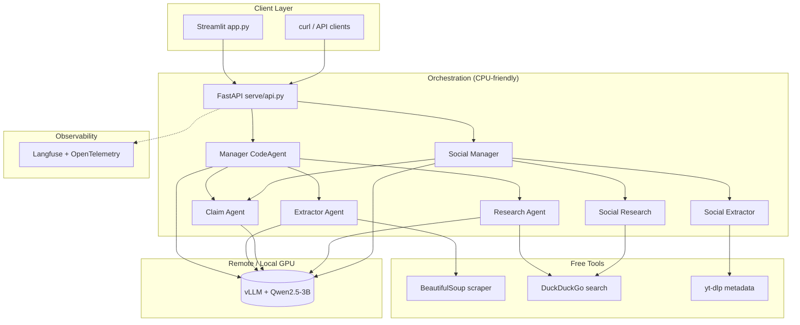

# Automated Fact-Checking Agentic Pipeline

**Author:** [Vaidahi Patel](https://github.com/itsvaidahipatel) (`itsvaidahipatel@gmail.com`)

**Misinformation spreads faster than manual fact-checking can keep up.** This project is a production-style, multi-agent system that takes a claim or social-media URL, orchestrates specialized AI agents, verifies against web evidence, and returns a structured verdict with confidence and citations — while keeping heavy LLM inference on cost-efficient local/remote GPU serving (vLLM).

---

## Demo & Visual Evidence

| Asset | Link / Location |
|-------|-----------------|
| **60s demo video** | _Add your Loom/YouTube link here_ → `https://www.loom.com/share/your-demo` |
| **Streamlit UI** | Run `streamlit run app.py` — architecture diagram, pipeline timeline, run history |
| **API docs** | `http://localhost:8080/docs` after starting FastAPI |

> **Tip for recruiters:** Record a short screen capture showing (1) Streamlit claim input, (2) spinner, (3) verdict + confidence, (4) run history table. Export as GIF and embed: ``.

---

## Architecture

**Distributed by design:** orchestration (Mac/local or API host) is separated from compute-heavy inference (GPU server running vLLM). Agents never call a paid cloud LLM API directly — they use an OpenAI-compatible endpoint pointed at your vLLM instance.



### Standard vs social-media pipelines

| Endpoint | Use case |
|----------|----------|
| `POST /fact-check` | General claims + optional article URL |
| `POST /fact-check-social` | Social URLs (X/YouTube/web) + trusted-domain search |

---

## Technical Story (Why This Is Senior-Level)

1. **Multi-agent orchestration (smolagents)** — A manager `CodeAgent` delegates to specialized sub-agents (extract → claim → research) instead of one brittle mega-prompt.
2. **Separation of concerns** — FastAPI handles I/O; agents handle reasoning; tools handle scraping/search; vLLM handles inference.
3. **Cost-aware inference** — vLLM with PagedAttention on a single GPU (e.g. AWS g5) serves all agents via one OpenAI-compatible base URL.
4. **Custom tool contracts** — Three-argument `final_answer` tool, DuckDuckGo research, social extraction (`yt-dlp`, nitter fallback, BeautifulSoup).
5. **Observability-ready** — Langfuse + `SmolagentsInstrumentor` hooks (token/latency traces per agent step).
6. **Evaluation & fine-tuning scaffold** — `evals/` golden-set hooks + Unsloth QLoRA path for claim-extraction specialization.
7. **Portfolio UI** — Streamlit dashboard with architecture diagram (Graphviz), pipeline timeline, confidence signals, and session run history.

---

## Tech Stack

| Layer | Technology |
|-------|------------|
| Orchestration | [smolagents](https://huggingface.co/docs/smolagents) |
| Inference | [vLLM](https://docs.vllm.ai/) (OpenAI-compatible) |
| API | FastAPI + Uvicorn |
| UI | Streamlit |
| Search | DuckDuckGo (free) |
| Scraping | BeautifulSoup, httpx, yt-dlp |
| Observability | Langfuse, OpenTelemetry |
| Fine-tuning | Unsloth QLoRA (optional GPU job) |
| Evaluation | Custom scripts + Ragas (optional) |

---

## Project Structure

```
├── agents/           # Manager, extractor, claim, research, social variants
├── tools/            # scraper, search, social_extractor, trusted_search
├── telemetry/        # Langfuse / OTEL setup
├── serve/            # FastAPI + vLLM deployment notes
├── finetuning/       # Unsloth QLoRA boilerplate
├── evals/            # Hallucination / accuracy evaluation
├── app.py            # Streamlit portfolio UI
├── config.py         # Centralized settings
├── requirements.txt
└── README.md
```

---

## Quick Start

### 1. Clone & install

```bash
git clone https://github.com/itsvaidahipatel/automated-fact-checking-pipeline.git
cd automated-fact-checking-pipeline
python3 -m venv .venv
source .venv/bin/activate
python -m pip install -r requirements.txt
cp .env.example .env
# Edit .env — set VLLM_BASE_URL to your GPU server (never commit .env)
```

### 2. Start vLLM (GPU machine)

See [serve/vllm_config.md](serve/vllm_config.md).

```bash
vllm serve Qwen/Qwen2.5-3B-Instruct --host 0.0.0.0 --port 8000
```

### 3. Start API (laptop or same host)

```bash
export PYTHONPATH=.
set -a && source .env && set +a
uvicorn serve.api:app --reload --host 0.0.0.0 --port 8080
```

### 4. Start Streamlit UI

```bash
streamlit run app.py
```

### 5. Verify via API

```bash
curl -X POST http://localhost:8080/fact-check \
  -H "Content-Type: application/json" \
  -d '{"claim": "Water boils at 100°C at sea level."}'
```

```bash
curl -X POST http://localhost:8080/fact-check-social \
  -H "Content-Type: application/json" \
  -d '{"claim": "The sun rises from the west."}'
```

Example response:

```json
{
  "status": "success",
  "verdict": "false",
  "confidence": 0.65,
  "summary": "Scientific consensus: the Sun appears to rise in the east due to Earth's rotation."
}
```

---

## Environment Variables

| Variable | Description |
|----------|-------------|
| `VLLM_BASE_URL` | OpenAI-compatible vLLM URL (e.g. `http://GPU_IP:8000/v1`) |
| `VLLM_MODEL_ID` | Model id served by vLLM |
| `ENABLE_TELEMETRY` | `true` / `false` for Langfuse tracing |
| `LANGFUSE_*` | Langfuse keys (optional) |

---

## Roadmap

- [ ] Golden evaluation set (50+ labeled claims) with published accuracy
- [ ] SafetyAgent + CitationAgent in manager workflow
- [ ] Docker Compose (vLLM + API + Langfuse)
- [ ] Fine-tuned claim-extraction model on vLLM

---

## Author & License

Built and maintained by **Vaidahi Patel**. MIT — see [LICENSE](LICENSE).
