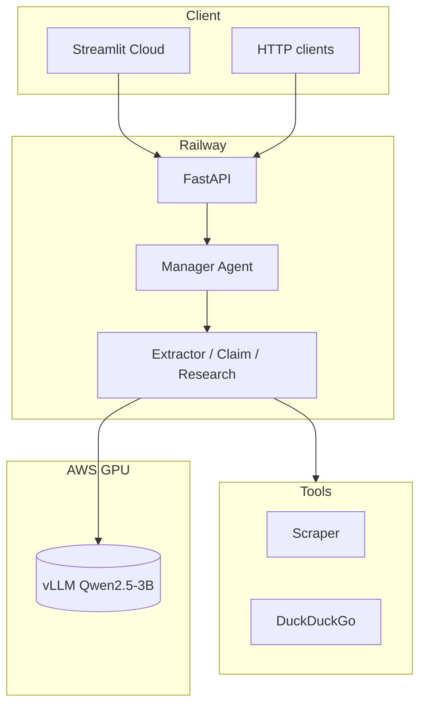

# Automated Fact-Checking Agentic Pipeline

[](https://github.com/itsvaidahipatel/automated-fact-checking-pipeline/actions/workflows/ci.yml)

**Vaidahi Patel** · [GitHub](https://github.com/itsvaidahipatel) · [Repository](https://github.com/itsvaidahipatel/automated-fact-checking-pipeline)

## Problem

Misinformation spreads faster than manual fact-checking can scale. This system automates verification: it takes a **claim or URL**, runs a **multi-agent pipeline** (extract → decompose → research), and returns a **structured verdict**, **confidence score**, and **source citations** — with GPU inference separated from orchestration via **vLLM**.

---

## Live demo

| | |
|---|---|
| **Repository** | https://github.com/itsvaidahipatel/automated-fact-checking-pipeline |
| **Live UI** | _Add Streamlit Cloud URL after deploy_ |
| **Live API** | _Add Railway URL `/docs` after deploy_ |
| **Demo video** | _Add YouTube/Loom link after recording_ |

Full deploy walkthrough: **[docs/SHOWCASE.md](docs/SHOWCASE.md)**

---

## Results

| Metric | Value |
|--------|-------|
| Eval dataset | 180 labeled claims ([fixture](evals/fixtures/labeled_claims.json)) |
| End-to-end accuracy | _Run eval on GPU — see [docs/SHOWCASE.md](docs/SHOWCASE.md)_ |
| Latest report | [evals/results/pipeline_eval_latest.json](evals/results/pipeline_eval_latest.json) |
| Methodology | [docs/EVAL.md](docs/EVAL.md) |

After GPU eval:

```bash
EVAL_LIMIT=20 ./scripts/run_eval_and_update_readme.sh
```

---

## Architecture

Orchestration (FastAPI + smolagents) runs on Railway; inference (vLLM) runs on a GPU host (AWS burst). Streamlit Cloud provides the UI.



| Endpoint | Description |
|----------|-------------|
| `POST /fact-check` | Claims and optional article URLs |
| `POST /fact-check-social` | Social URLs with prioritized domains |

Details: [docs/ARCHITECTURE.md](docs/ARCHITECTURE.md)

---

## Highlights

- Hierarchical agents (smolagents): extract → claim → research
- vLLM inference decoupled from FastAPI orchestration
- Citation grounding + API key auth + safety refusals
- 180-claim eval harness (political / scientific / statistical)
- Railway + Streamlit Cloud deploy; Docker + GitHub Actions CI

---

## Quick start (local)

```bash
git clone https://github.com/itsvaidahipatel/automated-fact-checking-pipeline.git
cd automated-fact-checking-pipeline
python3 -m venv .venv && source .venv/bin/activate
pip install -r requirements.txt
cp .env.example .env
```

```bash
# Terminal 1 — GPU host
vllm serve Qwen/Qwen2.5-3B-Instruct --host 0.0.0.0 --port 8000

# Terminal 2 — API
export PYTHONPATH=. && uvicorn serve.api:app --reload --port 8080

# Terminal 3 — UI
streamlit run app.py
```

---

## Configuration

| Variable | Description |
|----------|-------------|
| `VLLM_BASE_URL` | OpenAI-compatible vLLM endpoint |
| `API_KEY` | Required on Railway; sent as `X-API-Key` |
| `API_BASE_URL` | Streamlit → Railway API URL |
| `REQUIRE_CITATIONS` | Downgrade verdicts without evidence |

---

## Development

```bash
pip install -r requirements-dev.txt
pytest -q
```

---

## License

MIT — [LICENSE](LICENSE). Copyright © 2026 Vaidahi Patel.
