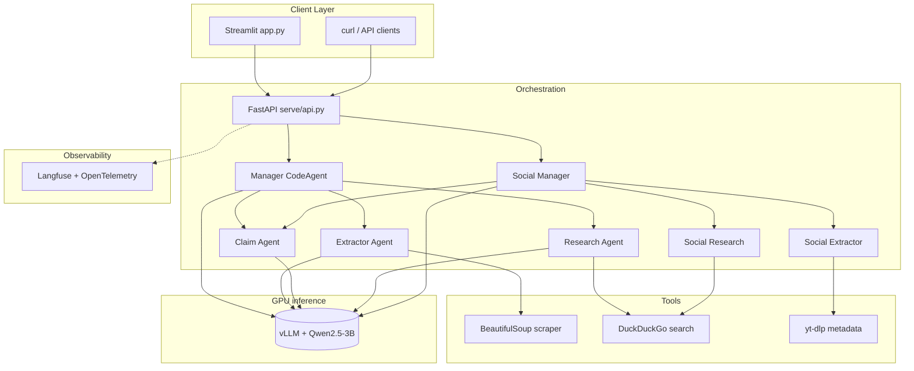

# Automated Fact-Checking Agentic Pipeline

[](https://github.com/itsvaidahipatel/automated-fact-checking-pipeline/actions/workflows/ci.yml)

Multi-agent system that verifies claims and social-media URLs against web evidence, returning a structured verdict with confidence scores and citations. Orchestration runs on a lightweight host; LLM inference is served separately via vLLM (OpenAI-compatible API).

**Author:** [Vaidahi Patel](https://github.com/itsvaidahipatel)

**Documentation:** [Architecture](docs/ARCHITECTURE.md) · [Evaluation](docs/EVAL.md) · [Resume blocks](docs/RESUME.md)

---

## Results

| Metric | Value |
|--------|-------|
| Labeled eval set | 52 claims ([fixture](evals/fixtures/labeled_claims.json)) |
| End-to-end accuracy | Run eval on vLLM host — see [docs/EVAL.md](docs/EVAL.md) |
| Latest report | [evals/results/pipeline_eval_latest.json](evals/results/pipeline_eval_latest.json) |

After a GPU eval run, commit `pipeline_eval_latest.json` and update the accuracy row with `metrics.accuracy` from that file.

```bash
python evals/run_pipeline_eval.py --ragas-subset 15 --output evals/results/pipeline_eval_latest.json
```

---

## Demo

| | |
|---|---|
| **Live UI** | `streamlit run app.py` (API on port 8080) |
| **API** | OpenAPI at `http://localhost:8080/docs` |
| **Video walkthrough** | Add your Loom/YouTube URL here after recording |

---

## Architecture

Orchestration (FastAPI + smolagents) is decoupled from GPU inference (vLLM). Details: [docs/ARCHITECTURE.md](docs/ARCHITECTURE.md).



### API endpoints

| Endpoint | Description |
|----------|-------------|
| `POST /fact-check` | Claim verification with optional article URL |
| `POST /fact-check-social` | Social URLs with domain-prioritized search |

Both return `verdict`, `confidence`, `summary`, and structured `citations`. Unsafe requests return `status: refused`.

---

## Design

1. **Hierarchical agents** — Manager routes to extractor, claim, and research sub-agents.
2. **Citation grounding** — Verdicts without URLs are downgraded when `REQUIRE_CITATIONS=true`.
3. **Safety refusals** — Prompt-injection and medical-diagnosis patterns blocked before agent runs.
4. **Cost-efficient serving** — Single vLLM instance backs all agent calls.
5. **Evaluation** — 52-claim labeled set, pipeline eval script, optional Ragas subset.
6. **Engineering** — Docker Compose (API + UI), GitHub Actions CI, pytest.

---

## Tech stack

| Layer | Technology |
|-------|------------|
| Orchestration | [smolagents](https://huggingface.co/docs/smolagents) |
| Inference | [vLLM](https://docs.vllm.ai/) |
| API | FastAPI, Uvicorn |
| UI | Streamlit |
| Search | DuckDuckGo |
| Scraping | BeautifulSoup, httpx, yt-dlp |
| Observability | Langfuse, OpenTelemetry |
| Evaluation | Ragas, custom pipeline eval |

---

## Setup

### Install

```bash
git clone https://github.com/itsvaidahipatel/automated-fact-checking-pipeline.git
cd automated-fact-checking-pipeline
python3 -m venv .venv
source .venv/bin/activate
python -m pip install -r requirements.txt
cp .env.example .env
```

Set `VLLM_BASE_URL` in `.env`. Do not commit `.env`.

### Docker (API + UI, external vLLM)

```bash
docker compose up --build
```

vLLM runs on a separate GPU machine; set `VLLM_BASE_URL` to reach it from the API container.

### Run locally

```bash
# GPU host
vllm serve Qwen/Qwen2.5-3B-Instruct --host 0.0.0.0 --port 8000

# Orchestration host
export PYTHONPATH=.
set -a && source .env && set +a
uvicorn serve.api:app --reload --host 0.0.0.0 --port 8080
streamlit run app.py
```

### Example response

```bash
curl -X POST http://localhost:8080/fact-check \
  -H "Content-Type: application/json" \
  -d '{"claim": "Water boils at 100°C at sea level."}'
```

```json
{
  "status": "success",
  "verdict": "true",
  "confidence": 0.72,
  "summary": "...",
  "citations": [
    {"url": "https://example.com/source", "snippet": "", "source_title": ""}
  ]
}
```

---

## Configuration

| Variable | Description |
|----------|-------------|
| `VLLM_BASE_URL` | OpenAI-compatible vLLM URL |
| `VLLM_MODEL_ID` | Model ID served by vLLM |
| `REQUIRE_CITATIONS` | Downgrade verdicts without evidence URLs |
| `ENABLE_TELEMETRY` | Langfuse tracing (`true` / `false`) |
| `LANGFUSE_*` | Langfuse credentials (optional) |

---

## Development

```bash
pip install -r requirements-dev.txt
ruff check agents tools serve tests
pytest -q
```

---

## License

MIT — [LICENSE](LICENSE). Copyright © 2026 Vaidahi Patel.
