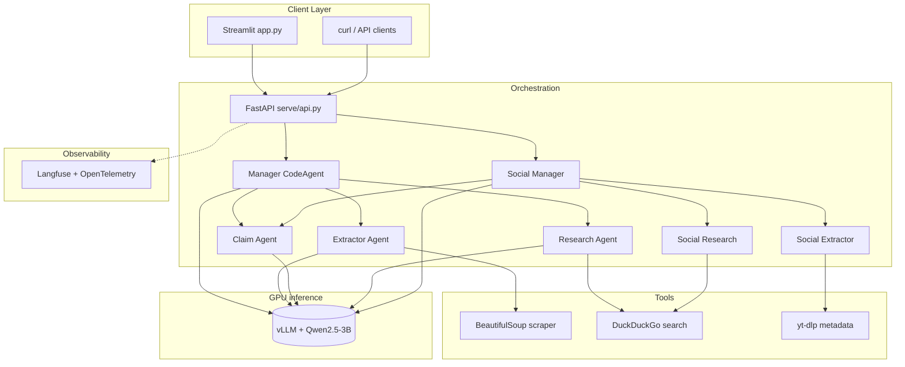

# Automated Fact-Checking Agentic Pipeline

Multi-agent system that verifies claims and social-media URLs against web evidence, returning a structured verdict with confidence scores and citations. Orchestration runs on a lightweight host; LLM inference is served separately via vLLM (OpenAI-compatible API).

**Author:** [Vaidahi Patel](https://github.com/itsvaidahipatel)

---

## Demo

| | |
|---|---|
| **Live UI** | `streamlit run app.py` (requires API on port 8080) |
| **API** | OpenAPI at `http://localhost:8080/docs` |
| **Walkthrough** | _Demo video link — add when available_ |

---

## Architecture

Orchestration (FastAPI + smolagents) is decoupled from GPU inference (vLLM). All agents call a single OpenAI-compatible endpoint; no managed cloud LLM API is required.



### API endpoints

| Endpoint | Description |
|----------|-------------|
| `POST /fact-check` | Claim verification with optional article URL |
| `POST /fact-check-social` | Social URLs (X, YouTube, web) with domain-prioritized search |

---

## Design

1. **Hierarchical agents** — Manager `CodeAgent` routes work to extractor, claim, and research sub-agents (smolagents).
2. **Layered responsibilities** — FastAPI for HTTP; agents for reasoning; tools for scrape/search; vLLM for inference.
3. **Cost-efficient serving** — One vLLM instance (PagedAttention) backs all agent calls through a shared base URL.
4. **Tooling** — Custom three-argument `final_answer`, DuckDuckGo research, social extraction (`yt-dlp`, nitter fallback, BeautifulSoup).
5. **Observability** — Optional Langfuse tracing via `SmolagentsInstrumentor`.
6. **MLOps hooks** — Evaluation fixtures in `evals/`; Unsloth QLoRA script for claim-extraction fine-tuning.
7. **UI** — Streamlit front-end with pipeline visualization and session run history.

---

## Tech stack

| Layer | Technology |
|-------|------------|
| Orchestration | [smolagents](https://huggingface.co/docs/smolagents) |
| Inference | [vLLM](https://docs.vllm.ai/) |
| API | FastAPI, Uvicorn |
| UI | Streamlit |
| Search | DuckDuckGo |
| Scraping | BeautifulSoup, httpx, yt-dlp |
| Observability | Langfuse, OpenTelemetry |
| Fine-tuning | Unsloth QLoRA |
| Evaluation | Custom scripts, Ragas (optional) |

---

## Project structure

```
├── agents/           # Manager, extractor, claim, research, social variants
├── tools/            # scraper, search, social_extractor, trusted_search
├── telemetry/        # Langfuse / OTEL setup
├── serve/            # FastAPI + vLLM deployment notes
├── finetuning/       # Unsloth QLoRA
├── evals/            # Accuracy / hallucination evaluation
├── app.py            # Streamlit UI
├── config.py
├── requirements.txt
└── README.md
```

---

## Setup

### Install

```bash
git clone https://github.com/itsvaidahipatel/automated-fact-checking-pipeline.git
cd automated-fact-checking-pipeline
python3 -m venv .venv
source .venv/bin/activate
python -m pip install -r requirements.txt
cp .env.example .env
```

Set `VLLM_BASE_URL` in `.env` to your inference server. Do not commit `.env`.

### Run vLLM (GPU host)

See [serve/vllm_config.md](serve/vllm_config.md).

```bash
vllm serve Qwen/Qwen2.5-3B-Instruct --host 0.0.0.0 --port 8000
```

### Run API

```bash
export PYTHONPATH=.
set -a && source .env && set +a
uvicorn serve.api:app --reload --host 0.0.0.0 --port 8080
```

### Run UI

```bash
streamlit run app.py
```

### Example request

```bash
curl -X POST http://localhost:8080/fact-check \
  -H "Content-Type: application/json" \
  -d '{"claim": "Water boils at 100°C at sea level."}'
```

```json
{
  "status": "success",
  "verdict": "false",
  "confidence": 0.65,
  "summary": "..."
}
```

---

## Configuration

| Variable | Description |
|----------|-------------|
| `VLLM_BASE_URL` | OpenAI-compatible vLLM URL |
| `VLLM_MODEL_ID` | Model ID served by vLLM |
| `ENABLE_TELEMETRY` | Enable Langfuse (`true` / `false`) |
| `LANGFUSE_*` | Langfuse credentials (optional) |

---

## License

MIT — [LICENSE](LICENSE). Copyright © 2026 Vaidahi Patel.
