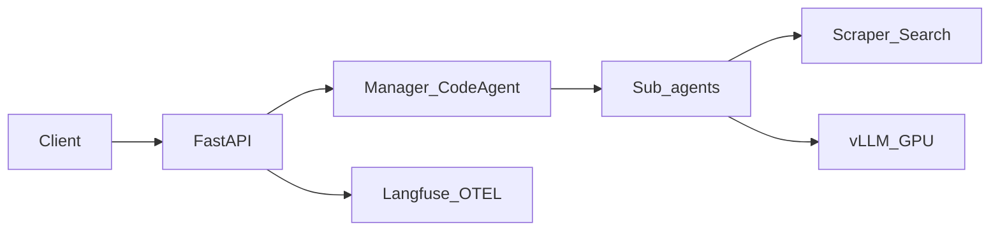

# Architecture

## Overview

The system separates **orchestration** (CPU-friendly API and multi-agent logic) from **inference** (GPU-hosted vLLM). Clients call FastAPI; agents call tools and the LLM through an OpenAI-compatible endpoint.

## Agent workflow (standard)

1. **Extractor** — Fetches page text when a URL is provided (`scrape_url_text`).
2. **Claim** — Isolates verifiable statements.
3. **Research** — Gathers evidence via DuckDuckGo search.
4. **Manager** — Synthesizes verdict, confidence, summary, and citations.

## Agent workflow (social)

1. **Social extractor** — YouTube metadata (`yt-dlp`), X/web fallbacks, BeautifulSoup.
2. **Claim** — Same claim isolation step.
3. **Social research** — Search with trusted-domain prioritization.
4. **Social manager** — Returns verdict plus citation URLs.

## Grounding and safety

- **Grounding** ([`agents/grounding.py`](../agents/grounding.py)): Extracts URLs from agent output. When `REQUIRE_CITATIONS=true`, verdicts of `true`/`false`/`mixed` without citations are downgraded to `inconclusive` with reduced confidence.
- **Safety** ([`serve/safety.py`](../serve/safety.py)): Rule-based refusal for prompt-injection patterns, oversized claims, and medical-diagnosis-style requests. Returns `status: refused` without invoking agents.

## Configuration

| Variable | Role |
|----------|------|
| `VLLM_BASE_URL` | OpenAI-compatible inference endpoint |
| `VLLM_MODEL_ID` | Model name served by vLLM |
| `REQUIRE_CITATIONS` | Enable grounding downgrade |
| `ENABLE_TELEMETRY` | Langfuse / OpenTelemetry |

## Deployment

- **Docker Compose** runs API + Streamlit on CPU; vLLM runs on a separate GPU host.
- **CI** runs lint and unit tests without GPU.
- **Full eval** runs manually on a GPU machine via [`evals/run_pipeline_eval.py`](../evals/run_pipeline_eval.py) (see [EVAL.md](EVAL.md)).

## Cost model

Use short GPU bursts for demos and evaluation (start instance → run vLLM → execute jobs → stop). Committed eval JSON and documentation describe quality without always-on inference hosting.
