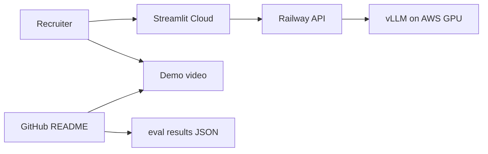

# Portfolio showcase setup

Complete workflow: deploy → start GPU → verify → eval → record video → stop everything.

**Author:** Vaidahi Patel  
**Repository:** https://github.com/itsvaidahipatel/automated-fact-checking-pipeline

---

## Architecture (what you deploy)



| Component | Host | Cost when idle |
|-----------|------|----------------|
| API | Railway | ~$5/mo or free trial credits |
| UI | Streamlit Cloud | Free |
| vLLM | AWS g5 (burst) | $0 when stopped |
| Proof | GitHub + YouTube | Free |

---

## Phase 1 — One-time setup (30 min)

### 1. Generate API key

```bash
openssl rand -hex 32
```

Save as `API_KEY` — use the **same value** on Railway and Streamlit.

### 2. Deploy API on Railway

1. Go to [railway.app](https://railway.app) → **New Project** → **Deploy from GitHub**
2. Select `automated-fact-checking-pipeline`
3. Railway uses [`railway.toml`](../railway.toml) + [`Dockerfile`](../Dockerfile) (start script: `scripts/start_api.sh` reads `$PORT`)
4. **Variables** (Railway → service → Variables):

| Variable | Value |
|----------|--------|
| `PYTHONPATH` | `.` |
| `VLLM_BASE_URL` | `http://YOUR_AWS_IP:8000/v1` (set after Phase 2) |
| `VLLM_MODEL_ID` | `Qwen/Qwen2.5-3B-Instruct` |
| `VLLM_API_KEY` | `EMPTY` |
| `API_KEY` | your generated key |
| `ENABLE_TELEMETRY` | `false` |
| `REQUIRE_CITATIONS` | `true` |
| `AGENT_MAX_STEPS` | `12` |

5. **Settings → Networking → Generate Domain**  
   Example: `https://fact-check-api-production.up.railway.app`

6. Test:

```bash
curl https://YOUR-RAILWAY-URL/health
```

### 3. Deploy UI on Streamlit Cloud (free)

1. Go to [share.streamlit.io](https://share.streamlit.io) → **New app**
2. Repo: `itsvaidahipatel/automated-fact-checking-pipeline`
3. Main file: `app.py`
4. **Advanced settings → Secrets** (paste TOML):

```toml
API_BASE_URL = "https://YOUR-RAILWAY-URL.up.railway.app"
API_KEY = "same-key-as-railway"
```

5. Deploy. Sidebar should show **API connected** when Railway is up.

---

## Phase 2 — Start AWS GPU for vLLM (demo day)

### 1. Launch EC2

- AMI: Deep Learning AMI (Ubuntu) or Amazon Linux with NVIDIA drivers
- Instance: **g5.xlarge** (or g4dn.xlarge)
- Security group: allow **SSH (22)** from your IP, **TCP 8000** from anywhere (or Railway IP range for tighter security)

### 2. SSH and install/start vLLM

```bash
ssh -i your-key.pem ubuntu@YOUR_EC2_IP

# First time only
python3 -m venv .venv && source .venv/bin/activate
pip install vllm

export HF_TOKEN=your_huggingface_token   # if needed
bash scripts/aws_start_vllm.sh
```

Or manually:

```bash
vllm serve Qwen/Qwen2.5-3B-Instruct --host 0.0.0.0 --port 8000 --max-model-len 8192
```

### 3. Point Railway at GPU

Update Railway variable:

```
VLLM_BASE_URL=http://YOUR_EC2_PUBLIC_IP:8000/v1
```

Railway redeploys automatically. Wait ~1 min.

### 4. Verify full stack

From your laptop:

```bash
chmod +x scripts/check_showcase_health.sh
./scripts/check_showcase_health.sh
```

Or set in `.env`:

```bash
API_BASE_URL=https://YOUR-RAILWAY-URL
API_KEY=your-key
VLLM_BASE_URL=http://YOUR_EC2_IP:8000/v1
```

Open Streamlit app → enter claim: *"Water boils at 100°C at sea level."* → Verify.

---

## Phase 3 — Eval + README numbers (GPU must be running)

Quick eval (20 claims, ~30–60 min):

```bash
export PYTHONPATH=.
set -a && source .env && set +a
chmod +x scripts/run_eval_and_update_readme.sh
EVAL_LIMIT=20 ./scripts/run_eval_and_update_readme.sh
```

Full eval (180 claims, 2–4 hours):

```bash
EVAL_LIMIT=180 ./scripts/run_eval_and_update_readme.sh
```

This updates `evals/results/pipeline_eval_latest.json` and the **Results** table in README.

Commit and push:

```bash
git add evals/results/pipeline_eval_latest.json README.md
git commit -m "docs: add pipeline eval results for portfolio showcase"
git push
```

---

## Phase 4 — Record demo video (~60 seconds)

Record screen showing:

1. **Streamlit** — enter claim → Verify → verdict + confidence + citations
2. **Terminal** — `./scripts/check_showcase_health.sh` or one `curl` to Railway
3. **GitHub** — README Results row with your accuracy %

Upload to YouTube (unlisted) or Loom.

Update README **Demo video** link:

```markdown
| **Demo video** | https://youtu.be/YOUR_VIDEO_ID |
```

Also add **Live demo** links:

```markdown
| **Live UI** | https://YOUR-APP.streamlit.app |
| **Live API** | https://YOUR-RAILWAY-URL/docs |
```

---

## Phase 5 — Stop everything (save money)

| Resource | Action |
|----------|--------|
| **AWS EC2** | Stop or terminate instance |
| **Railway** | Optional: scale to 0 or delete service (~$5/mo if left running) |
| **Streamlit Cloud** | Leave running (free) — UI shows "API unreachable" when GPU/API down; video + README still prove the work |

Your portfolio still works offline via **GitHub + video + eval JSON**.

---

## Resume checklist

- [ ] GitHub link on resume
- [ ] README has problem statement, architecture, Results %, demo video, CI badge
- [ ] One resume bullet with accuracy metric
- [ ] 60s demo video linked
- [ ] Can explain: multi-agent design, vLLM separation, grounding, eval failures

Copy blocks: [PROJECT_SUMMARY.md](PROJECT_SUMMARY.md)

---

## Troubleshooting

| Issue | Fix |
|-------|-----|
| Streamlit "API unreachable" | Check Railway URL in secrets; no trailing slash |
| 401 on fact-check | `API_KEY` mismatch between Railway and Streamlit |
| Pipeline timeout | GPU off, wrong `VLLM_BASE_URL`, or security group blocking 8000 |
| Railway crash | Ensure start command uses `$PORT` (see `railway.toml`) |
| Empty citations | Normal for some claims; grounding may downgrade to inconclusive |
